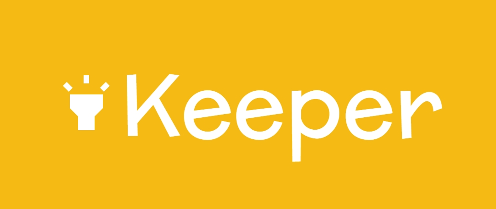

<div align="center">
  
  <br/>

  <h2><b>Keeper Note-taking App</b></h2>

</div>

<!-- TABLE OF CONTENTS -->

# 📗 Table of Contents

- [📖 About the Project](#about-project)
  - [🛠 Built With](#built-with)
    - [Tech Stack](#tech-stack)
    - [Key Features](#key-features)
  <!-- - [🚀 Live Demo](#live-demo) -->
- [💻 Getting Started](#getting-started)
  - [Prerequisites](#prerequisites)
  - [Setup](#setup)
  - [Install](#install)
  - [Usage](#usage)
  <!-- - [Run tests](#run-tests) -->
  <!-- - [Deployment](#deployment) -->
- [👥 Authors](#authors)
- [🔭 Future Features](#future-features)
<!-- - [🤝 Contributing](#contributing) -->
- [⭐️ Show your support](#support)
- [🙏 Acknowledgements](#acknowledgements)
- [❓ FAQ](#faq)
- [📝 License](#license)

<!-- PROJECT DESCRIPTION -->

# 📖 Keeper Note-taking App <a name="about-project"></a>

**Keeper** is a simple note-taking app built using React. Users can add notes with a title and content, helping them keep track of important information. This version doesn't yet have data persistence but serves as a demonstration of basic React functionality for dynamic user interaction.

## 🛠 Built With <a name="built-with"></a>

### Tech Stack <a name="tech-stack"></a>

<details>
  <summary>Client</summary>
  <ul>
    <li><a href="https://reactjs.org/">React.js</a></li>
    <li><a href="https://mui.com/">Material UI</a></li>
  </ul>
</details>

<!-- Features -->

### Key Features <a name="key-features"></a>

- **Add and display notes**: Users can create and view notes dynamically.
- **Title and content fields**: Separate fields for note titles and note contents.
- **Material UI integration**: Styled using Material UI components for a sleek, responsive design.

<p align="right">(<a href="#readme-top">back to top</a>)</p>

<!-- LIVE DEMO -->
<!-- 
## 🚀 Live Demo <a name="live-demo"></a>

- [Live Demo Link](https://google.com) (Add the actual demo link here once available)

<p align="right">(<a href="#readme-top">back to top</a>)</p> -->

<!-- GETTING STARTED -->

## 💻 Getting Started <a name="getting-started"></a>

To get a local copy up and running, follow these steps.

### Prerequisites

In order to run this project you need:

- A modern web browser
- Node.js installed on your local machine

### Setup

Clone this repository to your desired folder:

```sh
  git clone git@github.com:NebiyouBelaineh/keeper-note-app.git
  cd keeper-note-app
```

### Install

Install this project with:

```sh
  npm install
```

### Usage

To run the project, execute the following command:

```sh
  npm start
```


<p align="right">(<a href="#readme-top">back to top</a>)</p>

<!-- AUTHORS -->

## 👥 Authors <a name="authors"></a>

👤 **Nebiyou Belaineh**

- GitHub: [Nebiyou Belaineh](https://github.com/NebiyouBelaineh)
- X.com: [SeifuNebiyou](https://twitter.com/SeifuNebiyou)
- LinkedIn: [Nebiyou Belaineh](https://linkedin.com/in/nebyou-kassaye)

<p align="right">(<a href="#readme-top">back to top</a>)</p>

<!-- FUTURE FEATURES -->

## 🔭 Future Features <a name="future-features"></a>

- [ ] **Data persistence with a backend with either MongoDB or Firebase**
- [ ] **User authentication**
<!-- - [ ] **Dark mode toggle** -->

<p align="right">(<a href="#readme-top">back to top</a>)</p>

<!-- CONTRIBUTING -->
<!-- 
## 🤝 Contributing <a name="contributing"></a>

Contributions, issues, and feature requests are welcome!

Feel free to check the [issues page](../../issues/).

<p align="right">(<a href="#readme-top">back to top</a>)</p> -->

<!-- SUPPORT -->

## ⭐️ Show your support <a name="support"></a>

If you like this project, please give it a ⭐️!

<p align="right">(<a href="#readme-top">back to top</a>)</p>

<!-- ACKNOWLEDGEMENTS -->

## 🙏 Acknowledgments <a name="acknowledgements"></a>

I would like to thank the creators of React and Material UI for their awesome tools.

<p align="right">(<a href="#readme-top">back to top</a>)</p>

<!-- FAQ -->

## ❓ FAQ <a name="faq"></a>

- **Can I add more than just titles and content?**

  - Not in the current version, but future versions might support tags or categories for notes.

- **How do I make my notes persist across sessions?**

  - This version doesn't support persistence. You'll need to implement a backend to save notes.

<p align="right">(<a href="#readme-top">back to top</a>)</p>

<!-- LICENSE -->

## 📝 License <a name="license"></a>

This project is [MIT](./LICENSE) licensed.

<p align="right">(<a href="#readme-top">back to top</a>)</p>
